## An impressive equity curve can still describe a trade we cannot execute.

| What the chart shows | What the chart can hide              |
| ------------------- | ------------------------------------ |
| historical profits  | unavailable prices                   |
| smooth returns      | missing borrow constraints           |
| clean entries       | ambiguous clocks, venues, and orders |

::: {.notes}
Open by separating the chart from the trading system. A backtest may show a
beautiful equity curve, but that curve is useful only if the simulated trades
could have been placed. The chapter begins here because the danger is practical:
an implementation detail that looks small on paper can decide whether the live
strategy exists at all.
:::

## A useful backtest rehearses the live strategy before capital is at risk.

| Mode     | Data feed       | Strategy rule | Result            |
| -------- | --------------- | ------------- | ----------------- |
| Backtest | historical data | same rule     | simulated orders  |
| Live     | market data     | same rule     | executable orders |

The feed changes. The rule should not.

::: {.notes}
Define backtesting in plain terms: we feed historical data to a strategy and
ask how it would have performed. The key phrase is "would have." To make that
conditional meaningful, the backtest has to rehearse the rule we could actually
run live. Historical data and live data are different feeds; the trading logic
should not quietly become a different strategy.
:::

## Published strategies hide choices that can change returns.

| Published phrase    | Missing execution decision                      |
| ------------------- | ----------------------------------------------- |
| "buy at the open"   | MOO auction or market order after the open      |
| "use the close"     | primary auction, consolidated last, settlement  |
| "trigger on price"  | bid, ask, last trade, high, low                 |
| "trade S&P futures" | stock close at 4:00 p.m. or futures close 4:15 |

::: {.notes}
This is why Chan says we should independently backtest even a strategy from a
trusted publication. Published research often has to simplify the operational
details so the main idea stays readable. But "open," "close," and "price" are
not single objects in live trading. They are choices about auctions, clocks,
and price fields, and those choices can materially change profitability.
:::

## Independent backtesting turns an idea into an executable rule.

::: {.visual-slide}
::: {.visual-frame}
{fig-alt="Pipeline from published idea to executable rule through instrument, venue, timestamp, order type, backtest code, and execution code"}
:::
:::

::: {.notes}
Independent backtesting is not just a fact-checking exercise. It is the
translation layer between an informal idea and a rule that software can execute.
Instrument, venue, timestamp, order type, and price field all have to be pinned
down. Once they are encoded, the backtest becomes the first draft of the live
system rather than a separate spreadsheet story.
:::

## The best rehearsal keeps one strategy rule under two data feeds.

::: {.visual-slide}
::: {.visual-frame}
{fig-alt="Flow from same strategy logic to same timing rules to same execution assumptions"}
:::
:::

::: {.notes}
Now connect backtesting to automated execution. In the ideal design, the same
strategy logic can receive either a historical feed or a live market feed. This
does not make the strategy profitable by itself, but it reduces the gap between
the simulated rule and the executable rule. If the code has to be rewritten for
production, new assumptions can enter at exactly the moment we need discipline.
:::

## Pitfall checks ask whether the simulated trades could have existed.

| Strategy setting         | Feasibility question                    |
| ------------------------ | --------------------------------------- |
| Long-short stock book    | Were the short names borrowable?        |
| Intermarket futures pair | Did the two closing prices align?       |
| Published rule           | Did later data still support the rule?  |

::: {.notes}
Once every detail is explicit, the equity curve has to wait. First we ask
whether the trades were feasible. Could the short positions actually be
borrowed? Did both markets close at the same time? Did the rule survive data
that arrived after publication? These checks matter because most backtesting
pitfalls inflate performance instead of making it look worse.
:::

## True out-of-sample testing starts only after the rule is frozen.

::: {.visual-slide}
::: {.visual-frame}
{fig-alt="Timeline showing research period, publication boundary, and validation period"}
:::
:::

::: {.notes}
Out-of-sample testing sounds objective, but it can lose that objectivity. If a
researcher sees weak validation results and then changes parameters until the
same validation period looks good, that period is no longer a clean test.
Publication creates a clearer boundary because the rule is cast in stone. Data
after that point can test the rule with less opportunity for quiet revision.
:::

## Backtesting is an experiment cycle with a hard validation boundary.

::: {.visual-slide}
::: {.visual-frame}
{fig-alt="Experiment cycle from hypothesis to implementation to backtest result, revision, frozen rule, and walk-forward test"}
:::
:::

::: {.notes}
The research process still needs iteration. We start with a hypothesis about an
inefficiency, code the rule, test it, and revise when the evidence is weak.
That is the scientific method applied to trading. The discipline is knowing
when exploration stops. After the rule is frozen, the next data should evaluate
the strategy, not give us another chance to tune it.
:::

## A credible backtest answers one live-trading question: could this run tomorrow?

| Required answer | Evidence to look for                         |
| --------------- | -------------------------------------------- |
| Same rule       | one strategy logic path across modes         |
| Same timing     | signals use only information already known   |
| Same access     | venues, prices, orders, and borrow are real  |
| Same boundary   | validation data are not used for more tuning |

::: {.notes}
Close with the practical test. Before trusting the performance number, ask
whether this exact rule could run tomorrow with live data and real market
access. If the answer depends on future information, unavailable prices,
unborrowable stocks, or a validation period that was tuned repeatedly, the
backtest may be useful research. It is not yet evidence we should trade.
:::
