## Most pitfalls make the simulated market easier than the live market.

| Backtest shortcut | Live-trading reality | Main risk |
|---|---|---|
| Future information | Only current information | look-ahead |
| Surviving stocks | Delistings and failures | survivorship |
| Convenient prices | Executable prices | price mismatch |
| Generic quotes | Venue-specific quotes | venue mismatch |

::: {.notes}
Most backtesting pitfalls have the same direction of error: they make the
simulated market easier than the live market. The backtest may see information
too early, trade only securities that survived, use prices that were not
available in size, or rely on quotes from venues the strategy cannot access.
The result is not just noisy. It is biased toward performance that looks better
than the strategy could have achieved.
:::

## Look-ahead bias enters when today's signal uses tomorrow's information.

::: columns
::: {.column width="50%"}
{fig-alt="Flow showing that same-day high and low are unknown at the morning decision, so the entry signal cannot use them" width="100%"}
:::

::: {.column width="50%"}
```python
# unsafe in a same-day signal
signal_t = high_t > threshold

# safer shape
signal_t = raw_signal.shift(1)
```
:::
:::

::: {.notes}
Look-ahead bias means the backtest uses future information to make a current
decision. A daily high or low is the cleanest example. Before the trading day is
complete, the high and low are not known. If today's signal uses today's high,
the backtest is making a decision with information the live program could not
have. A safer implementation delays the raw signal so the position only uses
information available before the return is earned.
:::

## Shared backtest and live logic blocks one major source of look-ahead bias.

{fig-alt="Historical feed and live feed both entering one strategy function that produces orders" width="82%"}

| If the code path differs | If only the data feed differs |
|---|---|
| future columns can enter backtest logic | live constraints discipline the rule |
| simulated rule may not be tradable | backtest rule is closer to execution |

::: {.notes}
Chan's practical defense is to keep the backtest and live program as close as
possible. If the strategy function is the same and only the data feed changes,
future information has fewer places to enter. This design does not prove the
strategy will make money, but it removes one major class of programming error:
a backtest-only rule that could never run in the live market.
:::

## Validation stops being validation after the model is tuned to pass it.

{fig-alt="Loop showing holdout testing, poor result, parameter tweaking, and retesting on the same holdout" width="68%"}

::: {.notes}
Data-snooping bias starts when a model has enough freedom to fit random
historical patterns. The usual defense is an out-of-sample test, but that
defense fails when we keep tuning after seeing the holdout result. At that
point the holdout is no longer clean validation; it has become part of training.
Cross-validation helps when data are limited, and a final walk-forward test is
still needed after the rule is fixed.
:::

## Simpler linear rules leave fewer places to memorize noise.

| Design choice | Fitting freedom | Backtest risk |
|---|---|---|
| Many nonlinear rules | many thresholds and exceptions | high |
| Few linear terms | fewer knobs to tune | lower |
| Equal-weight ranks | sampling accidents matter less | lower |

::: {.notes}
The beauty of linearity is not that linear models are always true. The point is
that simple linear rules give the backtest fewer opportunities to memorize
noise. A nonlinear model may fit the historical sample better, but that better
fit does not guarantee better prediction. When a simple linear approximation is
available, the more complicated model needs a strong reason to justify the
extra data-snooping risk.
:::

## Splits and dividends are accounting events, not trading signals.

| Event | Price | Shares | Market value |
|---|---:|---:|---:|
| Before 2-for-1 split | 100 | 1 | 100 |
| After 2-for-1 split | 50 | 2 | 100 |
| Unadjusted price series | -50% |  | false signal |

::: {.notes}
A stock split changes the share count and the quoted price, but it does not
change the shareholder's market value. Dividends create a related issue because
the price drops while the shareholder receives a distribution. If the backtest
looks only at an unadjusted price series, these accounting events can look like
economic moves and trigger false trades. The historical series must be adjusted
before the signal uses it.
:::

## A survivor-only database makes recovery look predictable.

{fig-alt="Database filter showing survived stocks included and delisted or failed stocks missing" width="86%"}

| Mean-reversion trade | Bias direction |
|---|---|
| Long the biggest losers | performance inflated |
| Short failed firms | profits omitted |

::: {.notes}
Survivorship bias appears when the database contains only securities that still
exist today. For a long-only mean-reversion rule, this is especially dangerous.
The strategy may buy stocks that fell sharply, but the database keeps the names
that later recovered and removes many names that failed. The backtest then
acts as if the trader knew which beaten-down stocks would survive, which is
exactly the information the live trader did not have.
:::

## Auction strategies need primary-exchange prices, not consolidated outliers.

| Order in live trading | Price needed in the backtest |
|---|---|
| Market-on-open | primary opening auction |
| Market-on-close | primary closing auction |
| Signal from high/low | representative executable range |

{fig-alt="Comparison showing secondary venue odd print is not equal to primary auction fill" width="72%"}

::: {.notes}
U.S. stocks trade across many venues, but market-on-open and market-on-close
orders route to the primary exchange auction. A consolidated open or close may
come from a different venue, and a small secondary-market print can be far from
the auction price. A mean-reversion backtest can then profit from a price the
strategy could not actually fill. Auction strategies need primary-exchange
auction prices, or the result should be treated with skepticism.
:::

## Forex backtests are venue-specific because quotes and spreads are venue-specific.

| Venue | Bid-ask quote | Tradable by our strategy? |
|---|---|---|
| Bank or ECN A | one spread | maybe |
| Bank or ECN B | another spread | maybe |
| Aggregated book | combined quotes | only if executable |

::: {.notes}
Currency markets are more fragmented than stock markets, and there is no rule
requiring every venue to execute at the best bid or ask across all venues. That
means a foreign-exchange backtest is realistic only when the historical quotes
come from the same venue, or the same executable venue set, that the live
strategy can trade. Because spreads differ by venue, transaction costs and
apparent opportunities are venue-specific too.
:::

## A clean backtest matches live trading on information, universe, price, and venue.

| Gate | Passing evidence |
|---|---|
| Information | no future fields in current signals |
| Universe | delisted securities are represented |
| Price | corporate actions and auction prices are handled |
| Venue | historical quotes match executable venues |

::: {.notes}
The review checklist for this section has four gates. First, the information
gate asks whether each signal uses only what was known at decision time.
Second, the universe gate asks whether failed and delisted securities remain in
the test. Third, the price gate asks whether corporate actions and auction
prices are handled correctly. Fourth, the venue gate asks whether the historical
quotes match venues the live strategy can actually trade.
:::
