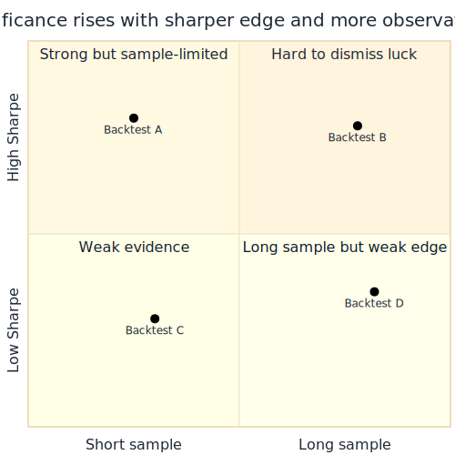

## A profitable sample can still be a lucky sample.

| What we observe        | What may still be true      |
| ---------------------- | --------------------------- |
| positive average return | true edge is zero          |
| smooth recent history  | sample happened to be kind  |
| big backtest profit    | finite data fooled us       |

::: {.notes}
Open by separating observed profit from demonstrated edge. Chan's point is not
that backtesting is useless, but that finite samples are noisy. A strategy can
look profitable simply because the historical slice happened to be favorable.
:::

## Hypothesis testing asks whether zero edge could still explain the result.

::: {.visual-slide}
::: {.visual-frame}
{fig-alt="Flow from observed backtest result to null hypothesis, null distribution, p-value, and decision about statistical significance"}
:::
:::

::: {.notes}
The null hypothesis is the skeptical baseline: suppose the strategy's true
average return is actually zero. Then ask how often a world with zero edge
would still generate a result at least as extreme as the one we observed.
:::

## The p-value is the probability of seeing a result this extreme under the null.

| Question                                   | Meaning                         |
| ------------------------------------------ | ------------------------------- |
| null hypothesis                            | true average return is zero     |
| test statistic                             | e.g. average daily return       |
| p-value                                    | chance of a result this extreme |
| small p-value                              | null looks hard to believe      |

::: {.notes}
Keep the interpretation precise. The p-value is not the probability that the
strategy is good. It is the probability of getting data this extreme if the
strategy has no real edge.
:::

## A high Sharpe ratio makes the zero-edge story harder to keep.

$$
t \approx \text{Sharpe}_{\text{daily}} \sqrt{n}
$$

| Daily Sharpe x $\sqrt{n}$ | Interpretation               |
| ------------------------: | ---------------------------- |
| small                     | lucky sample still plausible |
| large                     | zero-edge story strained     |

::: {.notes}
Under a Gaussian assumption, the familiar signal shows up again. The larger the
daily Sharpe ratio and the larger the sample size, the easier it becomes to
reject the zero-mean null hypothesis.
:::

## Significance depends on both effect size and sample length.

::: {.visual-slide}
::: {.visual-frame}
{fig-alt="Grid showing that higher Sharpe and more observations both increase statistical significance"}
:::
:::

::: {.notes}
One strong month is not the same as many years of strong results. A moderate
edge observed many times can be more persuasive than a dramatic edge seen only
briefly. The sample length matters because it tells us how much randomness has
had room to average out.
:::

## Critical values convert a test statistic into a significance threshold.

| p-value threshold | Critical value for daily Sharpe x $\sqrt{n}$ |
| ----------------: | -------------------------------------------: |
| 0.10              | 1.282                                        |
| 0.05              | 1.645                                        |
| 0.01              | 2.326                                        |
| 0.001             | 3.091                                        |

::: {.notes}
This is Chan's compact lookup table. If the test statistic crosses one of these
cutoffs, the corresponding p-value is at or below that threshold. Lower
p-values mean the observed performance is harder to explain as pure luck.
:::

## The hardest step is choosing the null distribution, not pressing the formula.

| Null-distribution choice   | What it assumes                       |
| -------------------------- | ------------------------------------- |
| Gaussian parametric model  | returns summarized by mean and spread |
| Monte Carlo simulation     | strategy rerun on many fake histories |
| richer simulation choices  | moments and structure matter          |

::: {.notes}
Chan is explicit that the real thinking is in step 3: what null world are we
comparing against? A parametric Gaussian assumption is simple, but a simulation
approach can ask whether the strategy is exploiting something subtler than just
mean and variance.
:::

## Monte Carlo asks how often fake histories beat the observed backtest.

::: {.visual-slide}
::: {.visual-frame}
{fig-alt="Loop from null market model to many simulated price paths, rerun strategy, collect returns, and compare to observed result"}
:::
:::

::: {.notes}
Instead of relying only on a closed-form distribution, we can generate many
synthetic price series under the null, run the strategy on each one, and count
how often the simulated return matches or exceeds the observed return. That
empirical fraction is the p-value.
:::

## Statistical significance says the edge is unlikely to be luck, not that it is tradable.

| What significance can support | What it cannot guarantee         |
| ----------------------------- | -------------------------------- |
| result is hard to explain by chance | implementation is realistic |
| edge is not obviously noise   | future markets will stay similar |
| sample is informative         | costs and constraints are handled |

::: {.notes}
Close by reconnecting this section to the earlier ones. A small p-value helps,
but it does not rescue a backtest with look-ahead bias, wrong prices, or
impossible fills. Statistical significance is one gate, not the whole proof.
:::
