## Some strategies should fail the smell test before they reach the backtester.

| Candidate claim            | Early screening question            |
| -------------------------- | ----------------------------------- |
| high average return        | Is the result consistent enough?    |
| impressive equity curve    | Is there a better trivial benchmark?|
| huge stock return claim    | Is the database obviously biased?   |

::: {.notes}
Open with a pragmatic shift. Chan is not contradicting the earlier chapters.
He is saying that research time is scarce, so obvious failures should be
filtered before implementation.
:::

## A high return with a weak Sharpe ratio is often a bad use of research time.

| Metric                       | Warning sign                  |
| ---------------------------- | ----------------------------- |
| annualized return            | looks attractive              |
| Sharpe ratio near zero       | returns are not consistent    |
| drawdown lasts for years     | traders may never stay in it  |

::: {.notes}
Chan's first rejection case is a strategy with a high annualized return, a low
Sharpe ratio, and an extremely long drawdown duration. The problem is not only
comfort. The inconsistency suggests that the attractive return may be a fluke.
:::

## Long drawdowns make the strategy fail both statistically and behaviorally.

::: {.visual-slide}
::: {.visual-frame}
{fig-alt="Screen showing high return candidate rejected because low Sharpe and long drawdown imply weak consistency and low investor endurance"}
:::
:::

::: {.notes}
This is a double filter. Statistically, long drawdowns make cross-validation
less likely to hold up. Practically, traders and investors may not tolerate the
pain long enough to discover whether the strategy recovers.
:::

## A strategy that loses to buy-and-hold is not adding trading skill.

| Candidate strategy                 | Simple comparison                 |
| ---------------------------------- | --------------------------------- |
| long-only crude oil futures rule   | front-month crude oil buy-and-hold|
| strategy return 20%                | benchmark return 47%              |
| strategy Sharpe 1.5                | benchmark Sharpe 1.7              |

::: {.notes}
Chan's second example is blunt. If a long-only trading rule on crude oil does
worse than simply holding the front-month contract, then the backtest has not
shown value added. Trading complexity has to beat the obvious baseline.
:::

## Benchmarks should become harder to beat as the strategy becomes simpler.

::: {.visual-slide}
::: {.visual-frame}
{fig-alt="Comparison path showing published strategy versus simple benchmark and reject if benchmark is better on return and Sharpe"}
:::
:::

::: {.notes}
This slide makes the screening rule operational. Before coding details, compare
the candidate idea with the simplest credible alternative. If the benchmark is
already better, the candidate probably does not deserve implementation time.
:::

## Some stock strategies are suspicious before the code even runs.

| Published claim                     | Immediate suspicion                    |
| ----------------------------------- | -------------------------------------- |
| enormous long-only stock return     | survivorship bias may dominate         |
| today’s winners chosen from survivors | delisted losers may be missing      |
| no database details provided        | backtest may be structurally inflated  |

::: {.notes}
Chan's third example is a huge long-only stock return claim. The first question
is not how to reproduce it. The first question is whether the stock database
included delisted names. If not, the result is probably inflated already.
:::

## The fastest screen is often a pitfall check, not a parameter search.

| Fast reject question               | Why it matters                     |
| ---------------------------------- | ---------------------------------- |
| Is the return consistent?          | low Sharpe can hide luck           |
| Can investors survive the drawdown?| behavior kills fragile strategies  |
| Does it beat a trivial benchmark?  | complexity must earn its keep      |
| Is the data source credible?       | biased databases waste effort      |

::: {.notes}
This is the section's central lesson. Early rejection is not laziness. It is a
discipline that protects time from being spent on strategies that fail basic
consistency, benchmarking, or data-quality standards.
:::

## Good researchers stop weak ideas early so stronger ideas get tested deeply.

| Decision                 | Research consequence              |
| ------------------------ | --------------------------------- |
| reject obvious weak idea | save coding and validation time   |
| keep only credible ideas | focus effort on real uncertainty  |
| backtest after screening | spend effort where details matter |

::: {.notes}
Close on the workflow implication. Backtesting is expensive in time and
attention. The point of this section is not to discourage testing, but to make
testing more selective and more valuable.
:::
