## Mean reversion is tradable only when price departures tend to pull back.

::: {.visual-slide}
::: {.visual-frame}
{fig-alt="Comparison between random-walk style drift and mean-reverting pullback, ending with the trading question of whether the current level predicts the next opposite move"}
:::
:::

::: {.notes}
Open with the difference between an appealing story and a tradable process.
Mean reversion is not merely "prices often come back." It means current price
level contains information about the next move. Without that pullback force,
buying low is just a slogan attached to a random walk.
:::

## Most financial prices are closer to random walks than to stationary ranges.

| Series type             | What usually wanders around a mean |
| ----------------------- | ---------------------------------- |
| stock or FX price level | often not the price itself         |
| return series           | often fluctuates around zero       |
| stationary price series | rare and therefore valuable        |

::: {.notes}
This is the chapter's first warning. In many financial markets, returns may
fluctuate around zero, but the price level itself often behaves like a
geometric random walk. That is why we need evidence before declaring a series
mean reverting.
:::

## Stationarity is the statistical face of mean reversion.

| Mean-reversion view                  | Stationarity view                        |
| ------------------------------------ | ---------------------------------------- |
| price change reacts to current level | variance grows slower than random walk   |
| asks whether pullback exists         | asks whether diffusion is sublinear      |
| leads to ADF intuition               | leads to Hurst and Variance Ratio tests  |

::: {.notes}
Chan treats mean reversion and stationarity as two views of the same phenomenon.
One focuses on how the next price change depends on the current level. The
other focuses on how quickly variance expands over time. The tests are
different, but the trading question is the same.
:::

## The ADF test asks whether the current price level helps predict the next move.

```text
If lambda = 0:
  next move does not depend on current level
  price behaves like a random walk

If lambda < 0:
  higher price tends to be followed by decline
  lower price tends to be followed by rebound
```

::: {.notes}
Keep the algebra in the notes and the logic on screen. The ADF test is useful
because it operationalizes the trading idea directly: does today's price level
say anything about tomorrow's move? If not, we do not have evidence for a
mean-reverting rule.
:::

## A negative coefficient is necessary, but statistical significance still matters.

| Outcome                           | Interpretation                            |
| --------------------------------- | ----------------------------------------- |
| negative but not significant      | maybe weak reversion, not enough evidence |
| significantly negative            | reject random-walk-style null             |
| positive                          | do not force a mean-reversion trade       |

::: {.notes}
Use USD.CAD as the chapter's cautionary example. The coefficient can point in
the right direction without being statistically strong enough to reject the
null. That does not automatically kill the trade, but it should lower our
confidence.
:::

## The Hurst exponent compresses the same question into one diffusion number.

| Hurst exponent | Reading                          |
| -------------- | -------------------------------- |
| H < 0.5        | mean reverting                   |
| H = 0.5        | geometric random walk            |
| H > 0.5        | trending                         |

::: {.notes}
The Hurst exponent gives a compact intuition. If diffusion is slower than a
random walk, H falls below 0.5. If diffusion is faster in one direction, H
rises above 0.5. It is not a strategy by itself, but it helps classify the
series.
:::

## The Variance Ratio test checks whether H is really different from 0.5.

| H estimate alone      | What is missing              |
| --------------------- | ---------------------------- |
| suggests reversion    | finite-sample significance   |
| suggests trend        | confidence of the estimate   |

The Variance Ratio test supplies that missing hypothesis test.

::: {.notes}
This slide closes the loop between intuition and inference. An estimated H of
0.49 may look slightly mean reverting, but without a hypothesis test we do not
know whether that difference from 0.5 is meaningful or just sampling noise.
:::

## Half-life translates a regression coefficient into trading time.

::: {.visual-slide}
::: {.visual-frame}
{fig-alt="Map from observed price series through ADF and Hurst or Variance Ratio tests to lambda, half-life, and the decisions to reject, wait, or build a strategy"}
:::
:::

::: {.notes}
This is where the chapter turns practical. A series can fail a strict academic
test and still be worth trading if reversion is fast enough. Half-life converts
the abstract coefficient into a business question: how long must capital wait
for the move to come back?
:::

## Long half-life can make a technically mean-reverting series commercially weak.

| Series property       | Trading consequence                   |
| --------------------- | ------------------------------------- |
| half-life very short  | more trades, faster evidence cycle    |
| half-life very long   | slow capital turnover, weaker edge    |
| lambda positive       | abandon mean-reversion framing        |

::: {.notes}
Chan's point is sharp here. If lambda is positive, the series is not mean
reverting. If lambda is only slightly negative, the half-life may be so long
that the strategy is impractical even if the statistic looks respectable.
:::

## A simple linear strategy scales in as the Z-score moves farther from the mean.

```python
z_score = (price - moving_average) / moving_std
position = -z_score
```

Lookback is often set near the half-life.

::: {.notes}
This is the chapter's simplest executable trading rule. Instead of waiting for
one hard threshold, the position size changes linearly with the normalized
distance from the mean. Chan uses it to show that strong ideas do not require a
large parameter set.
:::

## Preliminary tests matter because they use more data than a finished backtest.

| Preliminary test uses | Direct backtest uses                  |
| --------------------- | ------------------------------------- |
| nearly every bar      | only completed trade outcomes         |
| structural property   | one specific implementation instance  |
| higher statistical power | fewer observations of P&L         |

::: {.notes}
Close by defending the whole testing sequence. A direct backtest only sees the
trades you chose to place. A stationarity or half-life test uses the full price
path, so it often has more statistical power and gives a better early read on
whether a mean-reversion strategy is worth building at all.
:::
