## Cointegration lets traders manufacture stationarity from nonstationary assets.

::: {.visual-slide}
::: {.visual-frame}
{fig-alt="Two nonstationary assets combined through a hedge ratio into a stationary portfolio, with a side path showing that the wrong hedge ratio leaves the spread drifting"}
:::
:::

::: {.notes}
Open with the chapter's big opportunity. Most single price series are not
stationary, but a carefully chosen combination can be. Cointegration is the
reason mean-reversion trading has many more candidates than the rare naturally
stationary asset.
:::

## A hedge ratio defines how many units belong in the stationary portfolio.

| Hedge ratio answers      | Practical interpretation            |
| ------------------------ | ----------------------------------- |
| how much to long         | number of shares or contracts       |
| how much to short        | offsetting exposure                 |
| how to combine series    | portfolio price used as signal      |

::: {.notes}
This is the operational bridge from test to trade. Cointegration is not just a
label for two related charts. It requires a specific linear combination, which
means a specific allocation between long and short legs.
:::

## Pair trading is the simplest cointegration trade: long one asset, short another.

```text
portfolio price = asset A - h * asset B
```

If that portfolio is stationary, the pair is cointegrated under that hedge
ratio.

::: {.notes}
Keep this slide concrete. The familiar pair trade is just the two-asset version
of a more general stationary portfolio. The spread matters only under the right
hedge ratio; a random weighting will usually not create a usable signal.
:::

## CADF finds a hedge ratio first and then tests the resulting spread.

::: {.visual-slide}
::: {.visual-frame}
{fig-alt="Comparison of CADF and Johansen workflows showing CADF as order dependent and one relation at a time, while Johansen handles full baskets and multiple relations"}
:::
:::

::: {.notes}
This is Engle-Granger in trader language. CADF is convenient because it wraps
the regression and stationarity test together. But it inherits an important
limitation from the regression step.
:::

## CADF is order dependent, so one regression direction can pass while the other fails.

| Choose as dependent variable | Hedge ratio you get | Same result? |
| ---------------------------- | ------------------- | ------------ |
| EWC on EWA                   | one ratio           | not guaranteed |
| EWA on EWC                   | another ratio       | often different |

::: {.notes}
This is the main caution with CADF. Switching the dependent and independent
variables changes the regression coefficient, so the stationary spread you get
may change as well. In practice, Chan suggests checking both directions and
keeping the more convincing result.
:::

## EWA and EWC show why a visually related pair still needs a formal test.

| Visual clue                  | What the test confirms                |
| --------------------------- | ------------------------------------- |
| prices move together         | relationship may be structural       |
| scatter plot looks linear    | but stationarity still needs testing |

::: {.notes}
Use the Australia-Canada ETF example as the narrative anchor. The economies are
both commodity linked, so the pair looks plausible. But plausible co-movement
is not enough; the test has to confirm that the residual spread is stationary.
:::

## Johansen extends cointegration testing from pairs to full baskets.

| CADF                    | Johansen                          |
| ----------------------- | --------------------------------- |
| practical for one pair  | works for two or more series      |
| one relation at a time  | can find multiple relations       |
| order dependent         | order independent                 |

::: {.notes}
This slide marks the conceptual upgrade. Once we move beyond one pair, CADF is
not enough. Johansen works with the full system and can discover how many
independent stationary portfolios exist inside the basket.
:::

## Johansen's rank tells us how many independent mean-reverting portfolios exist.

| Rank r              | Reading                               |
| ------------------- | ------------------------------------- |
| r = 0               | no cointegrating relation             |
| r = 1               | one independent stationary portfolio  |
| r > 1               | multiple independent relations        |

::: {.notes}
This is the cleanest way to explain the test output. The rank is not an abstract
matrix detail for traders; it tells us how many distinct stationary combinations
the data support.
:::

## Johansen also returns eigenvectors that can be used as hedge ratios.

| Test by-product      | Trading use                            |
| -------------------- | -------------------------------------- |
| eigenvectors         | candidate portfolio weights            |
| eigenvalues / ranking | which relation may revert faster      |

::: {.notes}
This is why Johansen is so useful operationally. The test does not stop at
"yes" or "no." It hands back the portfolio weightings we can use to construct
the spread, and Chan notes that the leading relation often has the shortest
half-life.
:::

## Cointegration can involve three assets, not just a familiar pair.

| Basket example       | Possible outcome                       |
| -------------------- | -------------------------------------- |
| EWA, EWC, IGE        | more than one relation may exist       |
| larger basket        | stationary portfolios may multiply     |

::: {.notes}
Bring in the three-ETF example to show that pair trading is only the starting
point. Once a sector or macro theme links several assets, the trader can search
for stationary portfolios across the whole basket.
:::

## Cointegration expands the opportunity set without promising easy profits.

| What cointegration gives | What it does not guarantee            |
| ------------------------ | ------------------------------------- |
| many more candidate signals | immediate profitability            |
| structurally grounded spreads | short half-life or low costs      |
| hedge ratios from data      | immunity to breakdown               |

::: {.notes}
Close with the correct interpretation. Cointegration is powerful because it
creates candidates that would not exist if we only searched for stationary
single assets. But the resulting portfolio still needs half-life analysis,
backtesting, and risk management.
:::
