## Mean-reverting strategies often look unusually consistent in normal markets.

::: {.visual-slide}
::: {.visual-frame}
{fig-alt="Flow from frequent small wins and short drawdowns to high confidence, leverage creep, and the strategy feeling safest just before a rare break"}
:::
:::

::: {.notes}
Open with the attraction. Mean-reversion strategies can feel easier to trust
than trend strategies because the wins arrive frequently and losing periods are
often brief. That produces metrics traders and investors find psychologically
comfortable.
:::

## Fast half-life supports more trades, more evidence, and often a higher Sharpe ratio.

| Short time scale means | Practical consequence                 |
| ---------------------- | ------------------------------------- |
| prices snap back sooner | more round trips per year            |
| more observations       | greater statistical confidence       |
| capital recycles faster | stronger compounded return potential |

::: {.notes}
This slide links the chapter back to half-life. Faster reversion is not just a
nice statistical property. It creates more realized opportunities and lets the
backtest accumulate evidence faster.
:::

## The same consistency can create overconfidence.

| Long streak of success   | Behavioral risk                    |
| ------------------------ | ---------------------------------- |
| losses seem rare         | trader stops respecting tail risk  |
| drawdowns recover quickly | leverage starts to creep upward   |
| model feels obvious      | warnings are dismissed too easily  |

::: {.notes}
Here is the turn in the story. Consistency is not only a benefit. It changes
behavior. When traders stop seeing meaningful losses for a long time, they
often start treating the strategy as safer than it really is.
:::

## Mean reversion can fail catastrophically when the equilibrium itself shifts.

::: {.visual-slide}
::: {.visual-frame}
{fig-alt="Decision path where a deviation is treated as temporary, position is increased, and either the spread closes normally or a regime shift turns the trade into an escalating leveraged loss"}
:::
:::

::: {.notes}
This is the structural weakness. A mean-reversion trade assumes the deviation
is temporary. When the underlying economics change, the "cheap" asset can stay
cheap or become cheaper for a good reason, and the strategy keeps leaning into
the wrong move.
:::

## The worst break often happens when leverage is highest.

| Before breakdown         | At breakdown                         |
| ------------------------ | ------------------------------------ |
| long winning streak      | trader feels safest                  |
| leverage gradually rises | position is largest                  |
| one rare shock arrives   | loss is amplified                    |

::: {.notes}
Chan uses this to explain why rare losses are so painful. The disaster usually
does not strike when the trader is cautious. It strikes after success has
encouraged maximum leverage.
:::

## Stop losses are awkward for mean reversion because the strategy expects pain before recovery.

| Standard stop-loss logic | Mean-reversion conflict                |
| ------------------------ | -------------------------------------- |
| exit when loss grows     | widening loss may be normal entry zone |
| cut losers quickly       | trade thesis expects temporary stress  |

::: {.notes}
This is why risk management gets difficult. A trend strategy can often justify
cutting the trade when the move keeps going the wrong way. A mean-reversion
trade is built on the opposite logic, so ordinary stop-loss rules can clash
with the strategy's own premise.
:::

## Mean reversion offers attractive statistics, but its tail risk is lumpy and delayed.

| Benefit seen early       | Risk often seen late                  |
| ------------------------ | ------------------------------------- |
| smooth backtest          | rare structural blowup                |
| high hit rate            | one large loss can dominate           |
| calm capital path        | hidden fragility under leverage       |

::: {.notes}
This slide is the chapter's core caution. Mean-reversion strategies are not
bad because they lose often. They are dangerous because they can look safe for
a long time before one non-ordinary event rewrites the whole history.
:::

## The right lesson is not "avoid mean reversion" but "respect its special risk profile."

| Required discipline      | Reason                                |
| ------------------------ | ------------------------------------- |
| moderate leverage        | rare breaks arrive suddenly           |
| structural monitoring    | spreads can stop representing value   |
| dedicated risk framework | generic controls may misfire          |

::: {.notes}
Close by setting up Chapter 8. The issue is not that mean reversion cannot
work. The issue is that it needs risk management designed for strategies that
win often, lose rarely, and can fail because the underlying relationship
changes rather than because a signal was slightly noisy.
:::
