## The signal choice decides what portfolio we are actually trading.

| Signal form       | Hidden implementation claim          |
| ----------------- | ------------------------------------ |
| price spread      | fixed share counts                   |
| log price spread  | fixed capital weights with rebalancing |
| ratio             | scale-free relative comparison       |

::: {.notes}
Open by moving the focus away from indicators and toward portfolio meaning. The
same two assets can produce very different signals depending on whether we hold
shares fixed, capital fixed, or simply compare levels as a ratio.
:::

## A price spread is the simplest stationary portfolio when share counts are fixed.

```text
y = y1 - h * y2
```

The hedge ratio now means shares, not percentages.

::: {.notes}
This is the natural extension of Chapter 2. Once the hedge ratio is estimated,
the spread is just the unit-portfolio price. It is easy to interpret and cheap
to hold because the share counts do not need constant rebalancing.
:::

## A log-price spread changes the portfolio interpretation from shares to capital weights.

| Price spread world     | Log-price spread world              |
| ---------------------- | ----------------------------------- |
| fixed units            | fixed capital proportions           |
| simple holding logic   | ongoing rebalancing requirement     |

::: {.notes}
The key conceptual turn is that differencing logs converts the expression into
portfolio returns rather than portfolio prices. That makes the signal coherent,
but also makes the live implementation more labor intensive.
:::

## A ratio can stay stable even when the dollar spread grows with the asset level.

| Example               | Spread view           | Ratio view |
| --------------------- | --------------------- | ---------- |
| 10 vs 5               | spread = 5            | ratio = 2  |
| 100 vs 50             | spread = 50           | ratio = 2  |

::: {.notes}
This is why Chan treats ratios seriously even when strict cointegration is
absent. If both assets scale up together, the spread may wander while the ratio
still captures the same relative relationship.
:::

## Dynamic hedge ratios help nonideal pairs, but they also raise implementation cost.

::: {.visual-slide}
::: {.visual-frame}
{fig-alt="Map comparing price spread, log price spread, and ratio by portfolio interpretation, rebalancing burden, and when each is likely to be useful"}
:::
:::

::: {.notes}
Use one diagram to summarize the tradeoff. Adaptive hedge ratios make price
spreads more flexible, but the ratio can sometimes avoid the need to update the
weighting every period when the pair is only approximately mean reverting.
:::

## The GLD-USO comparison shows that the mathematically neat signal is not always the best trader's signal.

| Signal tested          | Chapter result                      |
| ---------------------- | ----------------------------------- |
| dynamic price spread   | best of the three in this example   |
| log price spread       | weaker after rebalancing burden     |
| ratio                  | poor here, despite intuitive appeal |

::: {.notes}
Close with the empirical discipline. The ratio has a good story and the log
spread has a clean capital interpretation, but Chan's example shows that the
dynamic price spread works better for this pair.
:::
