## Averaging-in feels right because bigger deviations promise bigger reversals.

| Intuition              | Hidden assumption                     |
| ---------------------- | ------------------------------------- |
| lower price is better  | probability structure stays unchanged |
| add on weakness        | deeper deviation still has same odds  |

::: {.notes}
Open by respecting the intuition before breaking it. Scaling-in is not foolish;
it is appealing because a larger deviation really can imply a larger gross
profit if mean reversion eventually happens.
:::

## Under a fixed two-path model, all-in beats averaging-in.

::: {.visual-slide}
::: {.visual-frame}
{fig-alt="Decision tree with entry at L1, possible further drop to L2 with probability p, and final reversion to F, comparing all-in at L1, all-in at L2, and averaging-in"}
:::
:::

::: {.notes}
Use the chapter's core setup directly: either the price reverts from L1, or it
falls to L2 first and then reverts to F. Once those paths and probabilities are
fixed, the arithmetic comparison becomes clean.
:::

## The best method switches with p, but the average-in method is never the winner.

| If probability p is... | Best method                           |
| ---------------------- | ------------------------------------- |
| small                  | all-in early at L1                    |
| large                  | all-in late at L2                     |
| intermediate           | average-in still not optimal          |

::: {.notes}
This is the surprising result. Scaling-in sits between the two all-in choices,
but it never dominates both when the probability structure is fixed.
:::

## Scaling-in can still help out of sample because real volatility is not constant.

| Static model says       | Live trading adds                     |
| ----------------------- | ------------------------------------- |
| one fixed probability p | changing volatility and changing odds |
| optimize pure mean      | care about realized Sharpe and robustness |

::: {.notes}
Close by rescuing the practical intuition. Chan does not ban scaling-in. He
says its justification comes from regime variation and risk-adjusted stability,
not from the fixed-probability thought experiment.
:::
