## The Kalman filter updates hedge ratio and mean without an arbitrary rolling cutoff.

| Rolling window problem     | Kalman filter response                 |
| -------------------------- | -------------------------------------- |
| old point suddenly removed | weights fade recursively instead       |
| hedge ratio can jump       | state evolves continuously             |

::: {.notes}
Open on the problem first. Traders already know rolling regressions. The issue
is that the moving cutoff is arbitrary and can make estimates jump when one bar
drops out of the window.
:::

## For a pair, the hidden state is the intercept and slope of the regression.

```text
y(t) = x(t) * beta(t) + noise
beta(t) = beta(t-1) + state noise
```

::: {.notes}
Keep the visible structure compact. The intercept and hedge ratio become a
two-dimensional hidden state, and the latest observation updates both at once.
:::

## The filter gives three things at once: dynamic hedge ratio, mean, and forecast uncertainty.

| Output                  | Trading use                           |
| ----------------------- | ------------------------------------- |
| slope                   | dynamic hedge ratio                   |
| intercept               | current mean of spread                |
| forecast-error variance | dynamic Bollinger-style band width    |

::: {.notes}
This is the practical payoff. The Kalman filter is not only a smoother hedge
ratio estimate. It also gives the moving mean and a model-based volatility
proxy for signal thresholds.
:::

## On EWA-EWC, the Kalman filter turns prediction error into a tradable mean-reversion signal.

::: {.visual-slide}
::: {.visual-frame}
{fig-alt="Flow from observed x and y prices into hidden state beta, predicted spread mean, forecast error e, variance Q, and long-short entry decisions"}
:::
:::

::: {.notes}
Close the slides with the actual signal pipeline: observe prices, update beta,
compute prediction error, compare error with its predicted standard deviation,
and trade when the deviation is large enough.
:::
