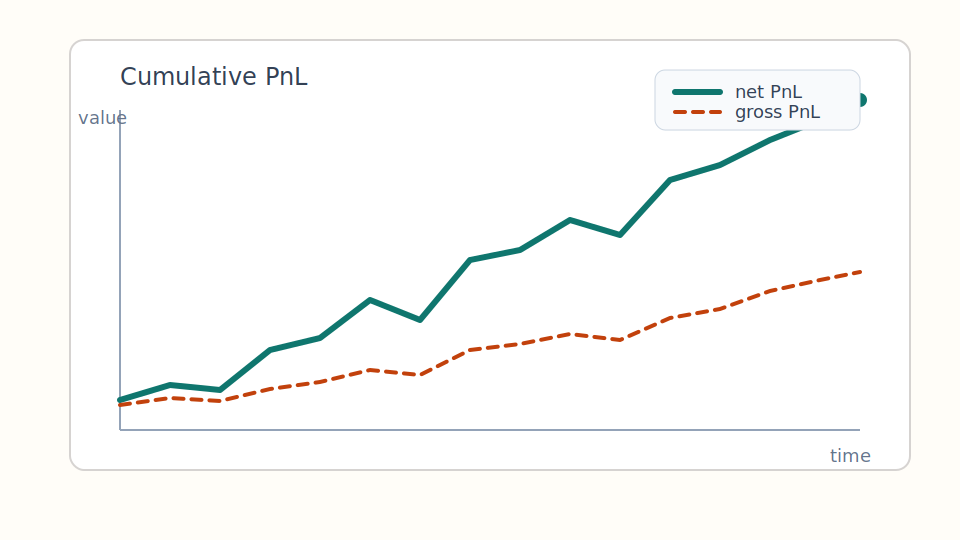
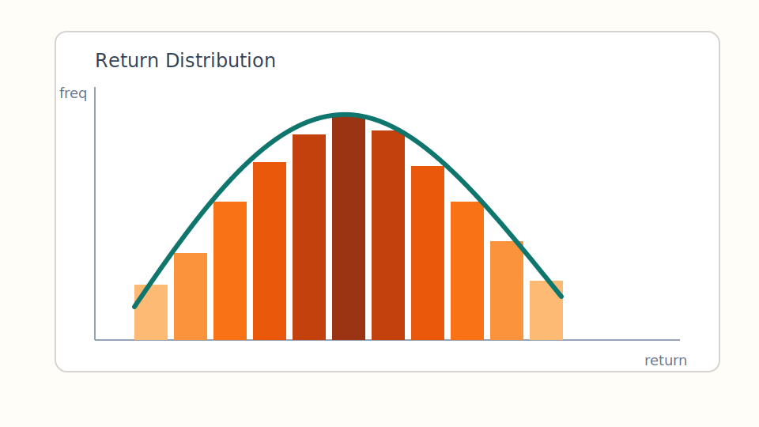

## What This Example Shows

- math
- code
- static figures
- pacing with fragments
- speaker notes for TTS
- a split between video slides and handout detail

::: {.notes}
This opening slide states the contract of the deck.
For video, keep the visible text sparse.
The detail should live in speaker notes or the handout.
If you drive TTS from notes, this block is a clean source for narration.
:::

## Research Loop

::: columns
::: {.column width="55%"}
1. Define the signal
2. Build tradable rules
3. Simulate PnL
4. Stress risk assumptions
5. Review failure modes
:::

::: {.column width="45%"}
$$
\text{PnL}_t = w_{t-1} \cdot r_t - c_t
$$

$$
\text{Sharpe} = \frac{\mathbb{E}[r_t]}{\sigma(r_t)} \sqrt{252}
$$
:::
:::

::: {.notes}
This is the kind of slide that reads cleanly in video.
The formulas are enough for visual anchoring, while the derivation belongs elsewhere.
Use this style when the narration carries the heavy load.
:::

## Pacing With Fragments

::: {.fragment}
First establish the idea: show the raw signal before any cost model.
:::

::: {.fragment}
Then add realistic execution: include slippage, fees, delay, and position caps.
:::

::: {.fragment}
Then show why the edge survives or fails: compare gross and net curves, not just headline Sharpe.
:::

::: {.notes}
Fragments are useful for video because they force cadence.
If TTS timing is fixed, each fragment should correspond to one sentence group.
:::

## Code On Slide

```python
import pandas as pd

prices = load_prices("SPY")
signal = prices["close"].pct_change(20)
position = signal.clip(-0.02, 0.02).shift(1)
returns = position * prices["close"].pct_change()

summary = {
    "ann_return": returns.mean() * 252,
    "ann_vol": returns.std() * (252 ** 0.5),
    "hit_rate": (returns > 0).mean(),
}
summary
```

::: {.notes}
Visible code should be short enough to parse in one shot.
Longer implementation details should move to the handout or repo.
:::

## Example PnL Figure

{fig-alt="Example cumulative PnL line chart" width="88%"}

::: {.notes}
For the actual course, this figure would usually be generated by Python during render.
The static SVG here only demonstrates layout and visual fit.
:::

## Example Distribution Figure

::: columns
::: {.column width="50%"}
{fig-alt="Example returns histogram" width="100%"}
:::

::: {.column width="50%"}
Visible takeaway:

- fat tails matter
- median can look stable while tail risk dominates
- never trust a smooth equity curve without a return distribution
:::
:::

::: {.notes}
This side-by-side format works well for narration.
One side holds the picture and the other side holds the spoken conclusion.
:::

## Split The Outputs

Video slides should optimize for:

- fewer words
- stronger sequencing
- clear charts
- tighter timing

Handouts should optimize for:

- derivations
- assumptions
- caveats
- implementation detail

::: {.notes}
Do not force one artifact to do both jobs well.
Use shared source material, but render different surfaces for different use.
:::

## Render Targets

From one project you can keep three outputs in sync:

- `revealjs` for video capture
- `html` for GitHub Pages reading
- `pdf` for print or offline review

```bash
quarto render slides/video-lesson.qmd
quarto render handouts/web-notes.qmd
quarto render handouts/pdf-notes.qmd
```

::: {.notes}
This closing slide points the audience or future maintainer to the operational model.
:::
